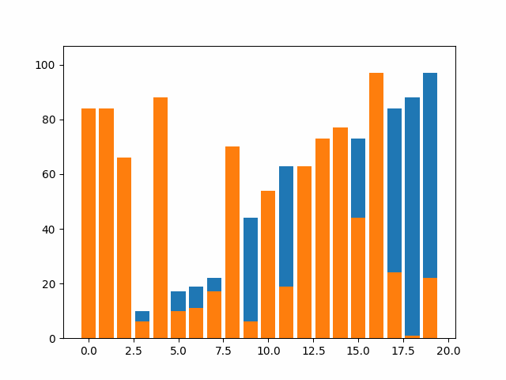

# Sorting Algorithms Research

## Inspiration
In this repository I wanted to conduct reserach into sorting algorithms and thier respective time complexities. Namely, I wanted to see and test if thier given time complexities are true and why do these time complexities matter (We always learn the theory side and the break down of time complexities however I wanted to see it for my self). This research project was inspired by my masters class at Northeastern EECE 7205 and many years of algorithms practice.

## <ins>Algorithms Used<ins>

### <ins>Insertion Sort<ins>

### <ins>Merge Sort<ins>

### <ins>Selection Sort<ins>

### <ins>Insertion Sort<ins>

### <ins>Selection Sort<ins>

### <ins>Bubble sort<ins>

### <ins>Heap sortt<ins>

### <ins>Quick Sort (naive)<ins>

### <ins>Quick Sort (improvment 1)<ins>

### <ins>Quick Sort (improvment 2)<ins>

### <ins>Counting Sort<ins>

### <ins>Radix Sort (naive)<ins>

### <ins>Radix Sort (improved)<ins>

### <ins>Counting Sort<ins>

### <ins>Butcher Odd Even Merge Sort<ins>

