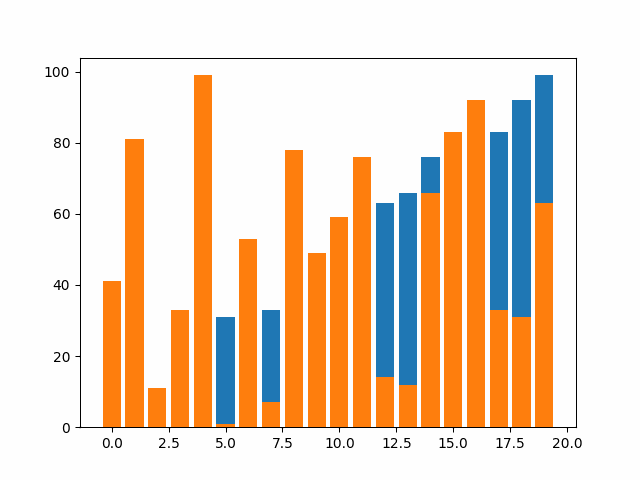
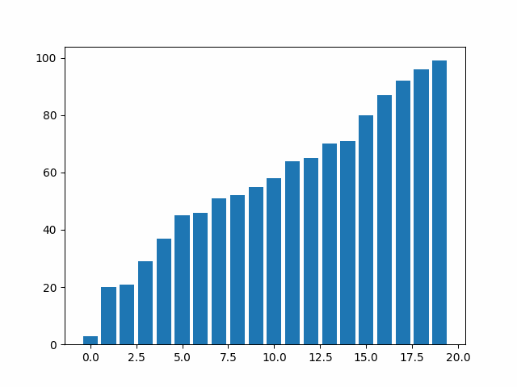
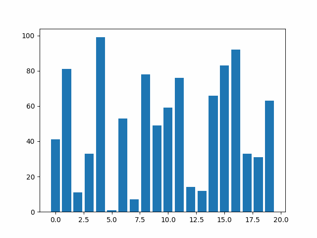
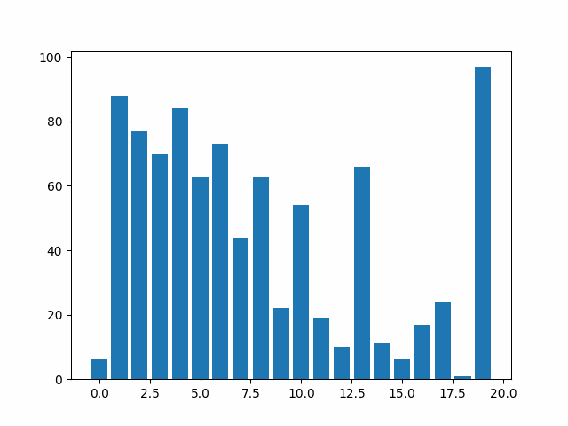
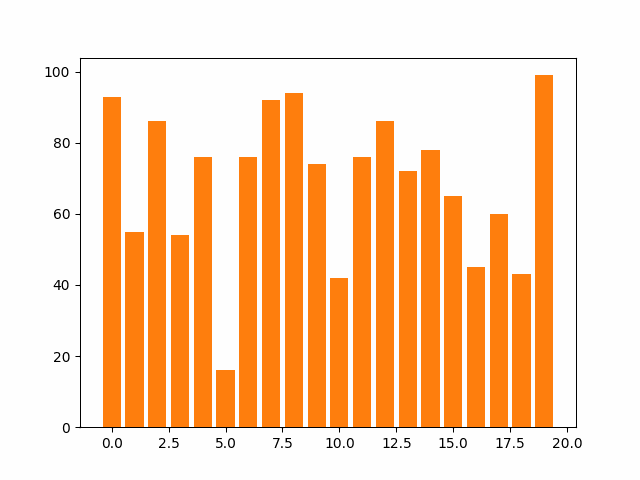
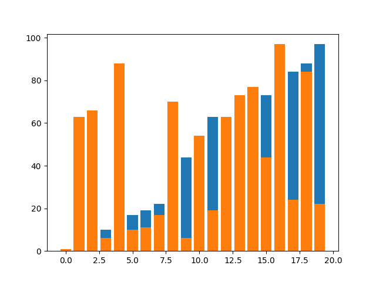
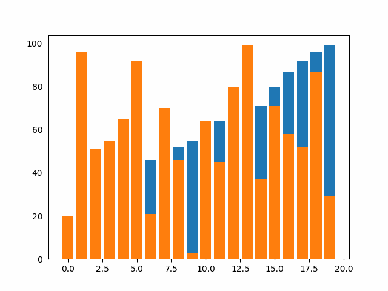
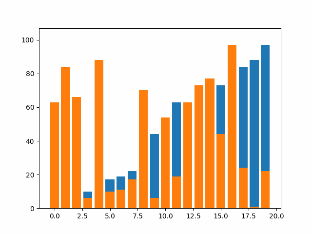

# Sorting Algorithms Research

## <ins>Inspiration<ins>
In this repository, I wanted to conduct reserach into sorting algorithms and their respective time complexities. Namely, I wanted to see and test if their given time complexities are true, why do these time complexities matter and visualise these sorting algorithms. An obesrvation that I had through out my learning is that we always learn the theory part of algorithms, namely we look at the psuedo code, break down the time complexities and sometimes as students we implement the algorithms just to finish the homewrok assingment. However, as a student, I found out that actualy visualising the algorithm almost always hooked me and made me understand the algorihtm/s much better. In this research project my aim is to inspect the sorting algorithms, visualise them, see how they compare to one another and see improvements to the algorithms to make them more efficent. This research project was inspired by my masters at *Northeastern University* and the class that I have took at Northeasern EECE 7205 and in addition to my many calsses from my Bachelors degree at *Moscow Insitute of Physics and Tecnology* and *Brandeis Univeristy*.

## <ins>Algorithms Used<ins>

### <ins>Insertion Sort<ins>

### <ins>Merge Sort<ins>

### <ins>Selection Sort<ins>

### <ins>Bubble sort<ins>

### <ins>Heap sort<ins>

### <ins>Quick Sort (naive)<ins>

### <ins>Quick Sort (improvment 1)<ins>

### <ins>Quick Sort (improvment 2)<ins>

### <ins>Counting Sort<ins>

### <ins>Radix Sort (naive)<ins>

### <ins>Radix Sort (improved)<ins>

### <ins>Butcher Odd Even Merge Sort<ins>

## <ins>Interesting Insight<ins>

It is very interesting how diffrent algorithms act with diffrent inputs. Eventhough, the diffrence between the sorting algorithms is always evidenet the diffrence becomes much clearer with larger inputs. An interesting fact that I have observed is that, similar execution algorithms typicaly have the same plot in the graph. This proves the correctness of their time complexity. Below I have listed two exampels:

In this exmaple its fairly clear that sorting algorithms like: *Counting Sort*, *Radix Sort*, *Quick Sort(improved 2)*, *Merge Sort*, *Heap sort* and *Butcher odd even merge sort* execute quicker then the other algorithms. Its also evident that these algorithms clump together on the plot. Eventhough, this graph shows that the *Butcher odd even merge sort* performs the worst of of the five best ones its kind of more evident when we look on a larger input.

## <ins>Further Analysis<ins>

For further in depth analysis please read the *research.pdf* file. In the reserach paper I will delve into every algorithm, their respective psuedo code and implemination, their time complexities, their time complexities tested on sorted, reverse sorted and unsorted lists, how these algorithms rival each other in day to day activities and how to imporve these algorithms for better perfromance.

