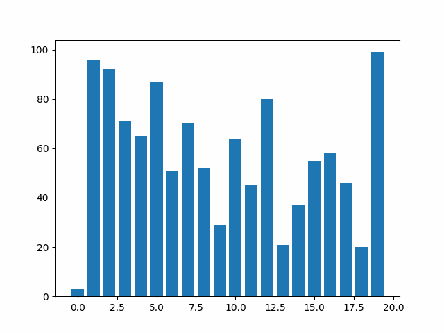
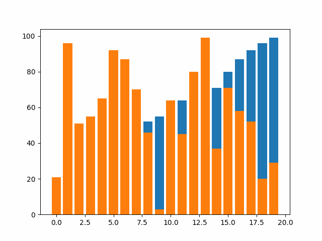

# Sorting Algorithms Research

## <ins>Inspiration<ins>
In this repository, I wanted to conduct reserach into sorting algorithms and their respective time complexities. Namely, I wanted to see and test if their given time complexities are true, why do these time complexities matter and visualise these sorting algorithms. An obesrvation that I had through out my learning is that we always learn the theory part of algorithms, namely we look at the psuedo code, break down the time complexities and sometimes as students we implement the algorithms just to finish the homewrok assingment. However, as a student, I found out that actualy visualising the algorithm almost always hooked me and made me understand the algorihtm/s much better. In this research project my aim is to inspect the sorting algorithms, visualise them, see how they compare to one another and see improvements to the algorithms to make them more efficent. This research project was inspired by my masters at *Northeastern University* and the class that I have took at Northeasern EECE 7205 and in addition to my many calsses from my Bachelors degree at *Moscow Insitute of Physics and Tecnology* and *Brandeis Univeristy*.

## <ins>Algorithms Used<ins>

### <ins>Insertion Sort<ins>

### <ins>Merge Sort<ins>

### <ins>Selection Sort<ins>

### <ins>Bubble sort<ins>

### <ins>Heap sort<ins>

### <ins>Quick Sort (naive)<ins>

### <ins>Quick Sort (improvment 1)<ins>

### <ins>Quick Sort (improvment 2)<ins>

### <ins>Counting Sort<ins>

### <ins>Radix Sort (naive)<ins>

### <ins>Radix Sort (improved)<ins>

### <ins>Butcher Odd Even Merge Sort<ins>

## <ins>Interesting Insight<ins>

It is fascinating to observe how different algorithms behave with varying inputs. While the differences between sorting algorithms are always apparent, these distinctions become much more pronounced with larger inputs. An interesting observation is that algorithms with similar execution times typically produce similar plots on a graph, which reinforces the correctness of their time complexity analysis. Below, I present three examples: the first example involves unsorted arrays with 5,000 elements, the second with 10,000 elements, and the third with 50,000 elements.

The differences between the algorithms are quite evident. Moreover, certain patterns emerge. For instance, algorithms with similar time complexities tend to cluster together on the graphs. However, even within these clusters, a hierarchy of better-performing algorithms is apparent. Additionally, it is intriguing to observe how algorithm performance varies depending on whether the inputs are sorted, randomly distributed, or reverse sorted. The following example illustrates this with array inputs of 5,000 values.

The results are quite intriguing. We observe that the graphs for sorted and reverse sorted inputs deviate from the clustering pattern noted earlier, with some algorithms behaving differently from the expected norm. To determine if this behavior is consistent with larger inputs, the next example will apply the same tests using arrays of 10,000 values.

With this new insight, we can draw several conclusions. First, the results for arrays with 10,000 inputs appear less chaotic compared to those with 5,000 inputs. The trend observed in the edge cases of sorted and reverse sorted arrays has persisted. In the case of reverse sorted inputs, a cluster has formed consisting of Merge Sort, Butcher Odd-Even Merge Sort, Heap Sort, Quick Sort, and Radix Sort. As noted earlier, there is a hierarchy within this cluster, with Quick Sort emerging as the best performer and Butcher Odd-Even Merge Sort as the least efficient. For the sorted input, a similar cluster of algorithms appears, with the addition of Insertion Sort and Counting Sort. To further validate these observations, the next test will be conducted using arrays of 50,000 values.

This confirms that the insights and hypotheses we previously deduced are valid and consistent throughout. On average, the performance of sorting algorithms tends to align with the expectations observed in the regular examples. However, in the two edge cases where the input array is either sorted or reverse sorted, certain algorithms perform better or worse, as illustrated in the graphs.

